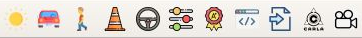

# QGIS OpenSCENARIO Generation Plugin

## Table of Contents
- [QGIS OpenSCENARIO Generation Plugin](#qgis-openscenario-generation-plugin)
  - [Table of Contents](#table-of-contents)
    - [Prerequisites](#prerequisites)
      - [Python Packages](#python-packages)
  - [Installation](#installation)
  - [Features](#features)
  - [Known Issues](#known-issues)
  - [OpenSCENARIO Support List](#openscenario-support-list)
    - [Environment](#environment)
    - [Actors](#actors)
    - [Static Objects (Props)](#static-objects-props)
    - [End Evaluation KPIs](#end-evaluation-kpis)
    - [Entity Maneuvers](#entity-maneuvers)
    - [Global Maneuvers](#global-maneuvers)
  - [Guide](#guide)
    - [Prerequisite](#prerequisite)
    - [Toolbar UI](#toolbar-ui)
    - [Adding Environment Variables](#adding-environment-variables)
    - [Adding Vehicles](#adding-vehicles)
    - [Adding Pedestrians](#adding-pedestrians)
    - [Removing Vehicles or Pedestrians](#removing-vehicles-or-pedestrians)
    - [Adding Maneuvers](#adding-maneuvers)
    - [Removing Maneuvers and Waypoints](#removing-maneuvers-and-waypoints)
    - [Editing Entity / Maneuver Parameters](#editing-entity--maneuver-parameters)
    - [Adding Own Parameters](#adding-own-parameters)
    - [Using Self-defined Parameters](#using-self-defined-parameters)
  - [Connecting to CARLA](#connecting-to-carla)
    - [Env variables](#env-variables)
    - [Adding Camera](#adding-camera)
      - [Place Camera Manually:](#place-camera-manually)
      - [Place Camera Automatically:](#place-camera-automatically)
    - [Play Scenario](#play-scenario)
    - [Stop Scenario](#stop-scenario)


### Prerequisites
- Python 3.6
- [QGIS 3](https://www.qgis.org/)
- [CARLA AD Map plugin version 2.4.5 and above](https://github.com/carla-simulator/map/releases)
- [CARLA](https://github.com/carla-simulator/carla/releases/) (Version >= 0.9.10)
- [CARLA Scenario Runner](https://github.com/carla-simulator/scenario_runner/releases)

#### Python Packages
- [pygame package](https://pypi.org/project/pygame/)
- [defusedxml package](https://pypi.org/project/defusedxml/)
- [numpy package](https://pypi.org/project/numpy/)
- [xmlschema package](https://pypi.org/project/xmlschema/)

Python packages can be installed using the supplied `requirements.txt` by:
```bash
pip3 install --user -r /path/to/requirements.txt
```

## Installation
1. Download the repo as a zip file in GitHub (`Code > Download ZIP`).
2. Run QGIS 3.
3. Install plugin from plugins menu (`Plugins > Manage and Install Plugins > Install from ZIP`), choose the zip file that was previously downloaded.

   _Note: If [CARLA AD Map plugin](https://github.com/carla-simulator/map/releases) has not been installed before, same steps can be used to install the ZIP package._


4. Change to `Installed` tab and make sure `OpenSCENARIO Editor Toolkit` is enabled.
5. Enjoy!

## Features
- Place entiites onto loaded OpenDRIVE map (through AD Map plugin)
- Specity start and stop triggers for maneuvers
- Add maneuvers to entities
- Add global maneuvers
  - Current support for traffic light actions only
- Set initial environment variables (cloud state, time of day, precipitation)

## Known Issues
- When map is unloaded and reloaded with AD Map Access, exporting scenarios might not work

## OpenSCENARIO Support List

_For the full support list, visit [OpenSCENARIO Tags Support](Docs/OpenSCENARIO_Support.md)_

✅ - Supported

❌ - Not supported

### Environment
| Description      | Support | Notes                                     |
| ---------------- | ------- | ----------------------------------------- |
| Time of day      | ✅       | Includes enabling animation of time       |
| Cloud state      | ✅       |
| Fog visual range | ✅       |
| Sun              | ✅       | Includes intensity, azimuth, elevation    |
| Precipitation    | ✅       | Includes precipitation type and intensity |

### Actors
| Description               | Support | Notes                                                                                       |
| ------------------------- | ------- | ------------------------------------------------------------------------------------------- |
| Spawn with World Position | ✅       |
| Set initial speed         | ✅       |
| Set orientation           | ✅       | Can either use lane heading, or manually specified                                          |
| Set as ego vehicle        | ✅       | Only for vehicles                                                                           |
| Agent selection           | ✅       | Only for ego vehicles (manual_control will require manually changing `Ego_1` tag to `hero`) |
| Agent parameter overrides | ❌       | Only for ego vehicles (overriding throttle, brake, clutch, parking brake, steering, gear)   |

### Static Objects (Props)
| Description               | Support | Notes                                              |
| ------------------------- | ------- | -------------------------------------------------- |
| Spawn with World Position | ✅       |
| Set object type           | ✅       |
| Set object mass           | ✅       |
| Set orientation           | ✅       | Can either use lane heading, or manually specified |
| Enable/Disable physics    | ✅       |

### End Evaluation KPIs
| Description            | Support | Notes |
| ---------------------- | ------- | ----- |
| Running stop test      | ✅       |
| Running red light test | ✅       |
| Wrong lane test        | ✅       |
| On sidewalk test       | ✅       |
| Keep lane test         | ✅       |
| Collision test         | ✅       |
| Driven distance test   | ✅       |

### Entity Maneuvers
| Description        | Support | Notes |
| ------------------ | ------- | ----- |
| Waypoints          | ✅       |
| Longitudinal       | ✅       |
| Lateral            | ✅       |
| Synchronize Action | ❌       |
| Teleport Action    | ❌       |

### Global Maneuvers
| Description           | Support | Notes                        |
| --------------------- | ------- | ---------------------------- |
| Environment           | ❌       |
| Infrastructure Action | ✅       | Traffic light signal control |


## Guide
### Prerequisite
1. Open OpenDRIVE map using CARLA AD Map plugin

### Toolbar UI



| Icon                                                                         | Description                                            |
| ---------------------------------------------------------------------------- | ------------------------------------------------------ |
|         | Edit environment                                       |
|             | Add vehicles                                           |
|       | Add pedestrians                                        |
|        | Add static objects                                     |
|           | Add maneuvers                                          |
|          | Add parameters                                         |
|  | Add end evaluation KPIs (Specific for Scenario Runner) |
|         | Export OpenSCENARIO file                               |
|       | Import OpenSCENARIO file                               |
|  | Connect to carla instance                              |
|               | Add bird eye view camera                               |


### Adding Environment Variables
1. Click on 'Edit environment' button to load dock widget.
2. Edit parameters in dock widget to desired parameters.

  

3. Press on 'Apply'

_Note: To change environment settings, simply adjust the parameters and press 'Apply' again. Previous environment settings will be cleared and replaced with the updated ones._

### Adding Vehicles
1. Click on 'Add vehicles' button to load dock widget.
2. Choose parameters (vehicle type, use lane heading / manually specify, initial speed)
3. Agent selection is only enabled for Ego vehicles. You can also specify your own agent.

  

4. Press on 'Insert', mouse pointer will change to cross-type pointer.
5. Click on desired map position to spawn vehicle.
6. If click point contains multiple lanes and 'Use lane heading' is checked, a dialog box will appear and ask to select lane ID to use for lane heading.

   

7. If click point contains lanes with multiple elevations, a dialog box will appear and ask to select the desired elevation.

   

_Note: Sometimes there will be a "Click point too far from lane" error. Try choosing a different elevation._

_Note: Currently you can insert vehicle one at a time._

_Note: You can toggle labels on and off by clicking on the 'Label' button_

### Adding Pedestrians
1. Click on 'Add pedestrians' button to load dock widget.
2. Choose parameters (pedestrian type, use lane heading / manually specify, initial speed)
3. If 'Use random pedestrian' is checked, a random pedestrian type will be selected for every spawned pedestrian.

   

4. Press on 'Insert', mouse pointer will change to cross-type pointer.
5. Click on desired map position to spawn pedestrian.
6. If click point contains multiple lanes and 'Use lane heading' is enabled, a dialog box will appear and ask to select lane ID to use for lane heading.

   

7. If click point contains lanes with multiple elevations, a dialog box will appear and ask to select the desired elevation.

   

_Note: Sometimes there will be a "Click point too far from lane" error. Try choosing a different elevation._

_Note: You can insert as many pedestrians as you desire after pressing on 'Insert'_

_Note: You can toggle labels on and off by clicking on the 'Label' button_

### Removing Vehicles or Pedestrians
1. In `Layers` right click on layer and select `Open Attribute Table`.

  

2. Click on the pencil icon on top left to enable editing.
3. Highlight the row containing the entity for deletion.
4. Click on trash can to delete entity.
5. Click on pencil icon to disable editing.
6. When prompted to save changes, choose 'Yes'.

### Adding Maneuvers
1. Click on 'Add Maneuvers' button to load dock widget.

   

2. Choose either to add entity maneuvers or global actions under `Maneuver Type`.
3. Entity maneuvers
   1. Choose entity to apply maneuver to, if entity is not listed, click on `Refresh entity list`.
   2. Set up start triggers of the maneuver using the `Start Triggers` tab.
   3. If stop triggers are needed, set up stop triggers of the maneuver using the `Stop Triggers` tab by checking the box beside `Stop Triggers`.
   4. Choose type of maneuver (waypoints, longitudinal, lateral)
      1. Waypoint Maneuvers
         1. Choose waypoint strategy and whether to use lane heading or user-defined heading.
         2. Click on `Insert`, and click on the map to spawn as many waypoints as intended.
         3. To end spawning of waypoints, click on the `Pan Map` tool (symbolized with a hand icon)
      2. Longitudinal and lateral maneuvers
         1. Choose the parameters.
         2. Click on `Insert`.
4. Global actions
   1. To enable/disable labels on traffic lights, press on `Toggle traffic light labels`.
   2. To refresh traffic light IDs, press on `Refresh traffic light IDs`.
   3. Choose the desired action.
   4. Set up the start triggers of the maneuvers using the `Triggers` tab.
   5. Click on `Insert`.

_Note: It is important to set up the start/stop triggers first before inserting the maneuver_
1. Special note for Reach Position Condition
   1. To set up `ReachPositionCondition`, click on `Choose position`.
   2. Click on a point on the map.
   3. The coordinates of the click point will be updated in the UI.

### Removing Maneuvers and Waypoints
1. In `Layers` right click on layer and select `Open Attribute Table`.

  

2. Click on the pencil icon on top left to enable editing.
3. Highlight the row containing the maneuver / waypoint for deletion.
4. Click on trash can to delete entity.
5. Click on pencil icon to disable editing.
6. When prompted to save changes, choose 'Yes'.

### Editing Entity / Maneuver Parameters
After inserting entities or maneuvers, you can edit them using the Attributes table.
1. In `Layers`, right click on layer and select `Open Attribute Table`.
2. Click on the pencil icon on top left to enable editing.
3. Double click on cell to edit.

   

4. Change the cell value.
5. When desired changes are complete, click on pencil icon to disable editing.
6. When promted to save changes, choose 'Yes'.

_Note: Changing the positions (X, Y, heading) in the attributes table does not update the positions seen in the map._

### Adding Own Parameters
You can define you own parameters to be used inside the scenario.
1. Click on the `Add Parameters` icon.
2. Setup parameters based on requirements (name, type, value).

   

3. Click on `Insert`.
4. If a parameter name already exists, the plugin will prompt you if you want to replace it.

_Note: To edit existing parameters, you can edit them directly using the Attributes table, or using the same parameter name and clicking on `Insert`. The plugin will ask for confirmation to replace the existing parameter._

### Using Self-defined Parameters
Parameters can be used when creating scenarios.
1. In the text field entry, simply input the name of the parameter to be used.
2. If the parameter does not exist, and error message will appear, as shown below.

   

## Connecting to CARLA

### Env variables

* For Scenario_Runner
```bash
export CARLA_ROOT=/path/to/your/carla/installation
export SCENARIO_RUNNER_ROOT=/path/to/your/scenario/runner/installation
export PYTHONPATH=$PYTHONPATH:${CARLA_ROOT}/PythonAPI/carla/dist/carla-<VERSION>.egg
export PYTHONPATH=$PYTHONPATH:${CARLA_ROOT}/PythonAPI/carla/agents
export PYTHONPATH=$PYTHONPATH:${CARLA_ROOT}/PythonAPI/carla
export PYTHONPATH=$PYTHONPATH:${CARLA_ROOT}/PythonAPI
```
1. Click on 'Carla-connect' button to load the dock widget.

   

2. To change the map, Choose a map from drop down menu.

   

3. Press on 'Change Map'

_Note: To change environment settings, simply select the map and press 'Change Map' again. Previous map will be cleared and replaced with the updated ones._

### Adding Camera

1. click on 'Add Camera' button to load Add camera dock widget.

    

#### Place Camera Manually:

* Select the height you want to place the bird eye camera from drop down menu.

    

* Click on 'Insert camera manually' button,  mouse pointer will change to cross-type pointer.
* Click on desired map position to spawn camera.

#### Place Camera Automatically:

* To place camera automatically click on 'Auto Insert Camera'. This will find the centroid of all actors spawned and place a bird eye view camera 30m above the centriod positon.

_Note: To use Automatic Camera placement, make sure you have added at least 2 actors/vehicles._


### Play Scenario

1. To Run the created scenario, press on 'Play Scenario' button.
2. This will pop up a Pygame window, where created scenario can be visulaized.

### Stop Scenario

1. To stop the Scenario click on 'Stop scenario button', this will destroy all actors and close py game window.
